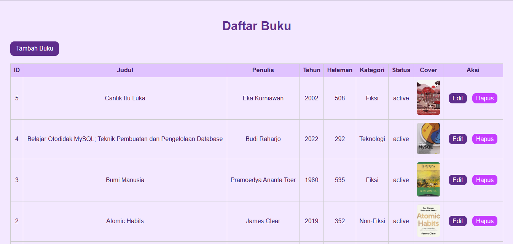
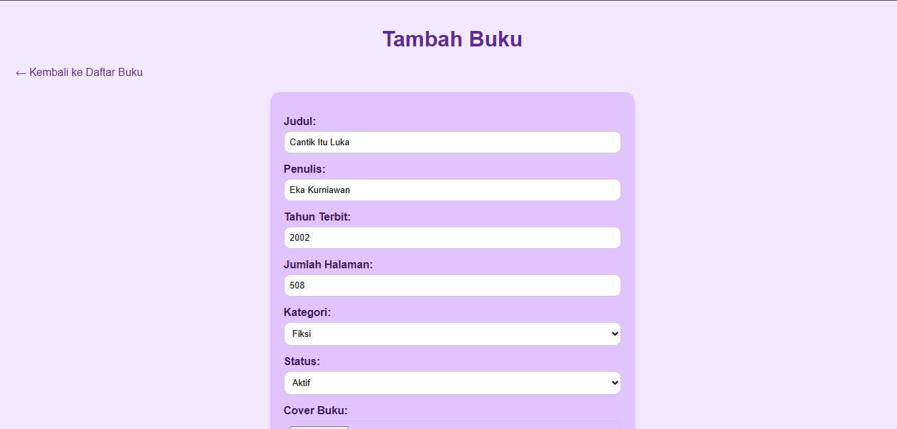
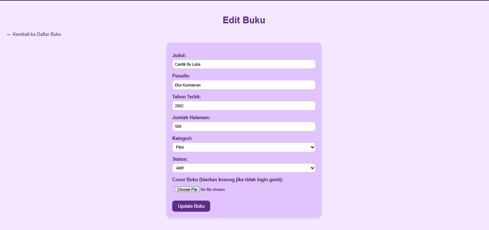

# Book CRUD - Aplikasi PHP Sederhana untuk Mengelola Data Buku

## Tentang Aplikasi
Aplikasi **Book CRUD** ini dibuat untuk memudahkan pengelolaan data buku.  
Tujuannya adalah agar pengguna bisa **menambah, melihat, mengubah, dan menghapus buku** secara cepat dan terstruktur. Aplikasi ini cocok digunakan di perpustakaan kecil, toko buku, atau untuk latihan membuat aplikasi back-end dengan PHP dan MySQL.

Aplikasi ini menggunakan **PHP 8.x** dan **MySQL/MariaDB**, menerapkan konsep **CRUD (Create, Read, Update, Delete)**, modularisasi kode, serta prinsip **Object-Oriented Programming (OOP) sederhana**.  
Dengan aplikasi ini, data buku tersimpan rapi di database, cover buku bisa di-upload, dan setiap aksi dilengkapi validasi agar data aman dan sesuai format.

---

## Detail Aplikasi

### Fitur Utama

**1. Create / Tambah Buku**
- Form untuk memasukkan judul, penulis, tahun terbit, jumlah halaman, kategori, status, dan cover buku.  
- Validasi input: teks wajib diisi, angka harus numeric, pilihan harus sesuai, file cover harus jpg/png < 2 MB.

**2. Read / Lihat Daftar Buku**
- Menampilkan semua buku dalam tabel dengan cover, judul, kategori, jumlah halaman, status, dan aksi Edit/Hapus.

**3. Update / Edit Buku**
- Form untuk mengubah data buku, termasuk opsi mengganti cover.  
- Data lama ditampilkan (pre-fill) agar mudah diedit.

**4. Delete / Hapus Buku**
- Menghapus buku dari database.  
- Bisa menambahkan konfirmasi sebelum menghapus.

---

## Alur Aplikasi


1. Pengguna membuka halaman utama (`index.php`) → menampilkan daftar semua buku. 


2. Pengguna klik **Tambah Buku** → masuk ke `create.php` → isi form → klik **Simpan Buku** → data tersimpan ke database + cover disimpan di folder `uploads/`.  


3. Pengguna klik **Edit** → masuk ke `edit.php?id=…` → form sudah terisi data lama → ubah data → klik **Update Buku** → data diperbarui.  
4. Pengguna klik **Hapus** → buku dihapus dari database.

---

## Kode yang Digunakan
- **PHP 8.x** untuk back-end  
- **PDO** untuk koneksi dan query database  
- **HTML + CSS** untuk form dan tabel  
- CSS sederhana: warna ungu pastel, tombol persegi dengan sudut melengkung  
- Struktur OOP sederhana:  
  - `Book.php` → CRUD Book  
  - `Utility.php` → Validasi input & upload file  

Contoh fungsi di `Book.php`:

```php
public function getById($id) {
    $stmt = $this->conn->prepare("SELECT * FROM books WHERE id = :id");
    $stmt->execute(['id' => $id]);
    return $stmt->fetch(PDO::FETCH_ASSOC);
}


